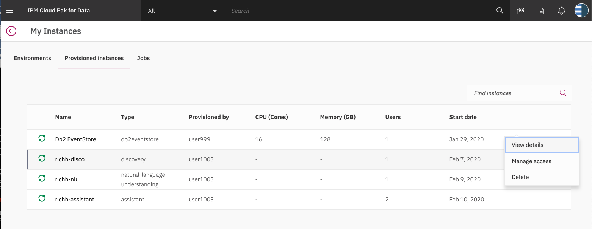

# Costumer Assistane Chatbot For E-ticket Website FlightGo

## What is an Assistant Search Skill?

An Assistant search skill is a mechanism that allows you to directly query a Watson Discovery collection from your Assistant dialog. A search skill is triggered when the dialog reaches a node that has a search skill enabled. The user query is then passed to the Watson Discovery collection via the search skill, and the results are returned to the dialog for display to the user.

Click [here](https://cloud.ibm.com/docs/services/assistant?topic=assistant-skill-search-add) for more information about the Watson Assistant search skill.

> **NOTE**: Another method of integrating Watson Assistant with Watson Discovery is through the use of a webhook, which can be created using IBM Cloud Functions. Click [here](https://github.com/IBM/watson-discovery-sdu-with-assistant) to view a code pattern that uses this technique.

## Flow


1. The data source is annotated using Watson Discovery SDU
1. The user interacts with the backend server via the app UI. The frontend app UI is a chatbot that engages the user in a conversation.
1. Dialog between the user and backend server is coordinated using a Watson Assistant dialog skill.
1. If the user asks a product operation question, a search query is issued to the Watson Discovery service via a Watson Assistant search skill.

# Steps:

1. [Clone the repo](#1-clone-the-repo)
1. [Create Watson services](#2-create-watson-services)
1. [Configure Watson Discovery](#3-configure-watson-discovery)
1. [Configure Watson Assistant](#4-configure-watson-assistant)
1. [Configure to website](#5-configure-to-website)

### 1. Clone the repo

```bash
git clone https://github.com/SyahriRhamadhan/WEB-Pem-Mobile
```

### 2. Create Watson services

Create the following services:

* **Watson Assistant**
* **Watson Discovery**

The instructions will depend on whether you are provisioning services using IBM Cloud Pak for Data or on IBM Cloud.

Click to expand one:

<details><summary><b>IBM Cloud Pak for Data</b></summary>
<p>
<i>Use the following instructions for each of the services.</i>
<p>
<h5>Install and provision service instances</h5>
<p>
The services are not available by default. An administrator must install them on the IBM Cloud Pak for Data platform, and you must be given access to the service. To determine whether the service is installed, Click the <b>Services</b> icon () and check whether the service is enabled.
</details>

<details><summary><b>IBM Cloud</b></summary>
<p>
<h5>Create the service instances</h5>
  <ul>
    <li>If you do not have an IBM Cloud account, register for a free trial account <a href="https://cloud.ibm.com/registration">here</a>.</li>
    <li>Create a <b>Assistant</b> instance from <a href="https://cloud.ibm.com/catalog/services/watson-assistant">the catalog</a>.</li>
    <li>Create a <b>Discovery</b> instance from <a href="https://cloud.ibm.com/catalog/services/discovery">the catalog</a> and select the default "Plus" plan.</li>
  </ul>

  >**NOTE**: The first instance of the `Plus` plan for IBM Watson Discovery comes with a free 30-day trial; it is chargeable once the trial is over. If you no longer require your Plus instance for Watson Discovery after going through this exercise, feel free to delete it.
</details>

### 3. Configure Watson Discovery

Start by launching your Watson Discovery instance. How you do this will depend on whether you provisioned the instance on IBM Cloud Pak for Data or on IBM Cloud.

Click to expand one:

<details><summary><b>IBM Cloud Pak for Data</b></summary>

Find the Discovery service in your list of `Provisioned Instances` in your IBM Cloud Pak for Data Dashboard.

Click on `View Details` from the options menu associated with your Discovery service.

  

Click on `Open Watson Discovery`.

  

</details>

<details><summary><b>IBM Cloud</b></summary>

From the IBM Cloud dashboard, click on your new Discovery service in the resource list.

  

From the `Manage` tab panel of your Discovery service, click the `Launch Watson Discovery` button.

</details>

### Create a project and collection

The landing page for Watson Discovery is a panel showing your current projects.

Create a new project by clicking the `New Project` tile.

> **NOTE**: The Watson Discovery service queries are defaulted to be performed on all collections within a project. For this reason, it is advised that you create a new project to contain the collection we will be creating for this code pattern.

  

Give the project a unique name and select the `Document Retrieval` option, then click `Next`.

  

For data source, click on the `Web Crawl` tile and click `Next`.

  

Enter a unique name for your collection and click `Finish`.

### Web Crawl Data

On the `Configure Collection` panel, at `Specify where you want to crawl` add new link

  

>**NOTE**: The `Ecobee` is a popular residential thermostat that has a wifi interface and multiple configuration options.

Then, click the `Finish` button.

Note that after the file is loaded it may take some time for Watson Discovery to process the file and make it available for use. You should see a notification once the file is ready.


### 4. Configure Watson Assistant

The instructions for configuring Watson Assistant are basically the same for both IBM Cloud Pak for Data and IBM Cloud.

One difference is how you launch the Watson Assistant service. Click to expand one:

<details><summary><b>IBM Cloud Pak for Data</b></summary>

Find the Assistant service in your list of `Provisioned Instances` in your IBM Cloud Pak for Data Dashboard.

Click on `View Details` from the options menu associated with your Assistant service.

Click on `Open Watson Assistant`.

</details>

<details><summary><b>IBM Cloud</b></summary>

Find the Assistant service in your IBM Cloud Dashboard.

Click on the service and then click on Launch tool.

</details>

### Create assistant

From the main Assistant panel, you will see tab options - `Environments` and `Skills`. An `Environments` is the container for a set of `Skills`.

Go to the Environments tab and click `Extensions with search icon` at rigth bottom.

  


#### Add new intent

The default customer care dialog does not have a way to deal with any questions involving outside resources, so we will need to add this.

Create a new `intent` that can detect when the user is asking about operating the Ecobee thermostat.

From the `Customer Care Sample Skill` panel, select the `Intents` tab.

Click the `Create intent` button.

Name the intent `#NewsInfo`, and at a minimum, enter the following example questions to be associated with it.


#### Create new dialog node

Now we need to add a node to handle our intent. Click on the back arrow in the top left corner of the panel to return to the main panel. Click on the `Dialog` tab to bring up the nodes defined for the dialog.

Click the `Add node` button.

Name the node "News info"and assign it our new intent.


In the `Assistant responds` dropdown, select the option `Search skill`.

This means that if Watson Assistant recognizes a user input such as "What today news?", it will direct the conversation to this node, which will integrate with the search skill.

### Create Assistant search skill

Return to the Environments panel by clicking the `Environments` icon in the left menu pane.

From your Environments panel, click on `Extensions search` at the right bottom.

Give your search skill a unique name, then click `Continue`.

From the search Configuration panel, select the Discovery service instance and collection you created previously.


Click `Next` to continue.

From the `Configure result content` panel, les it set as default.


You can customize the return `Message` to be more appropriate for your use case.

Click `Save` to complete the configuration.

Now when the dialog skill node invokes the search skill, the search skill will query the Discovery collection and display the text result to the user.

### Test in Assistant Tooling
After all configuration completed you can test the chatbot with search skill at watson assistance `Try it` button and send message with keyword `News`. 


### 5. Configure to website

To configure API click at `Preview Tabs` then at top right click `Costumize web app` then click the `Embed`. Copy the code and paste at `src/App.js`

.png)


# Sample Output
.png)

